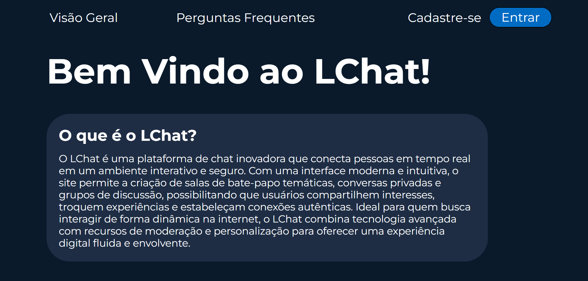
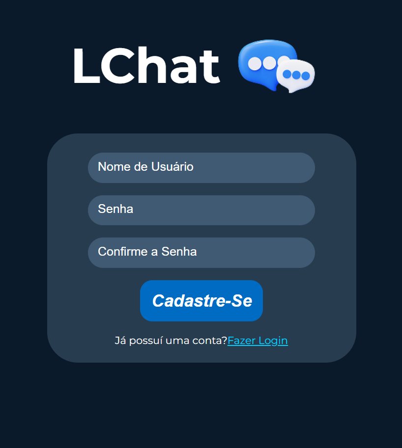
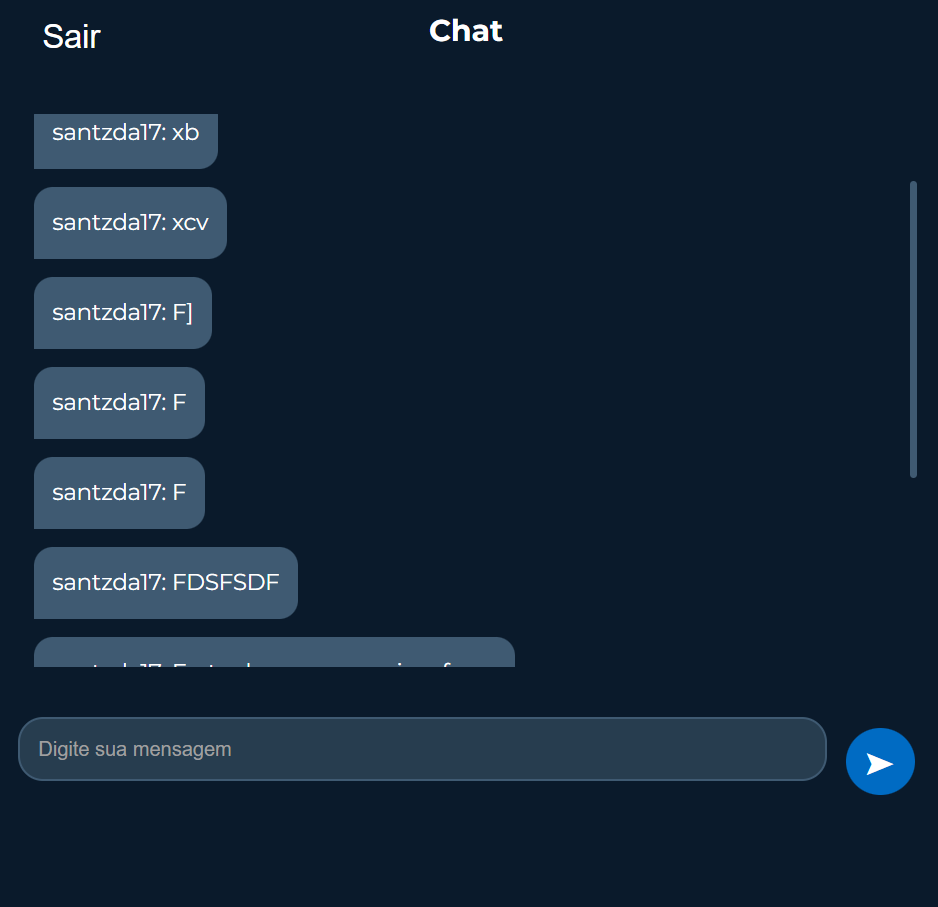

# Web Chat
---
Este repositório contém uma aplicação web de um chat de conversas por texto online, criado para aprofundar os conhecimentos no microframework Flask em python

# Demonstração Visual

# Tecnologias Utilizadas
HTML, CSS, Python/SocketIO

Link da Aplicação: https://web-chat-santiago.onrender.com
