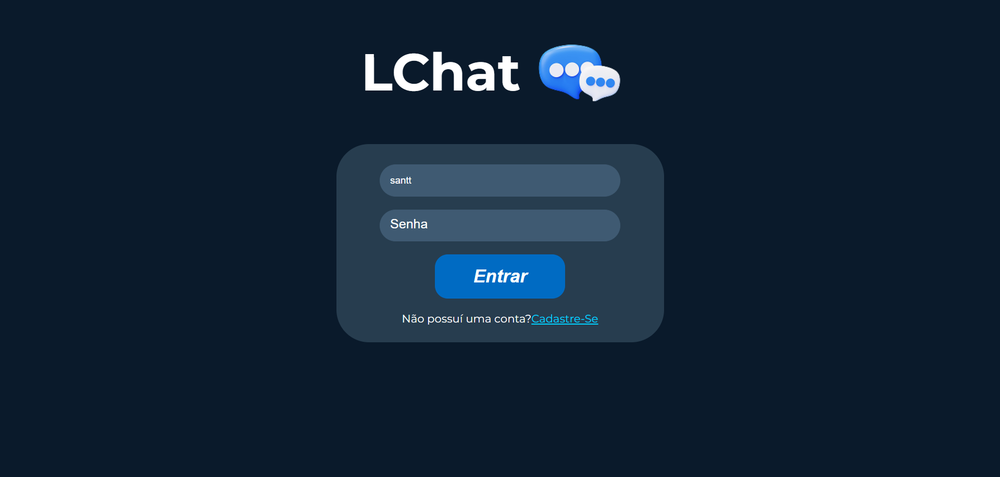
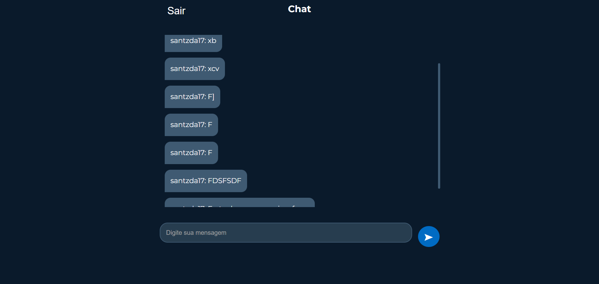

# Web Chat
---
Este repositório contém uma aplicação web de um chat de conversas por texto online, criado para aprofundar os conhecimentos no microframework Flask em python

# Demonstração Visual 🔎

# Tecnologias Utilizadas 💻
- **HTML:** Estruturação do Web Chat
- **CSS:** Estilização do Web CHat
- **Python:** Linguagem utilizada para construção da aplicação, incialização do servidor e navegação por rotas
- **SocketIO:** Microframework utilizado para as interações entre os computadores em tempo real

# Pré-Requisitos ⚙
- Python instalado na máquina.
- Biblioteca Flask instalada.
- Biblioteca Socket.IO Instalada.

# Link de Download 💾
A aplicação web pode ser baixada e testada, para implementação de melhorias ou fins educacionais através: [Deste Link](https://downgit.github.io/#/home?url=https://github.com/carlossant77/web-chat)

# Demostração da Aplicação 🚀
A aplicação pode ser testada através: [Deste Link](https://web-chat-santiago.onrender.com)
